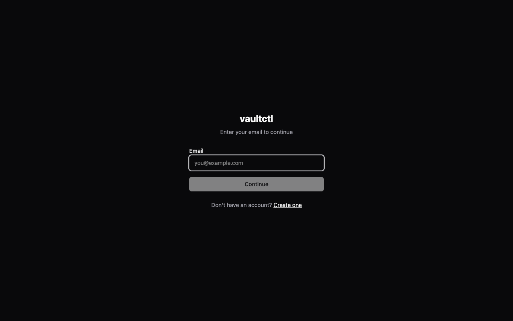
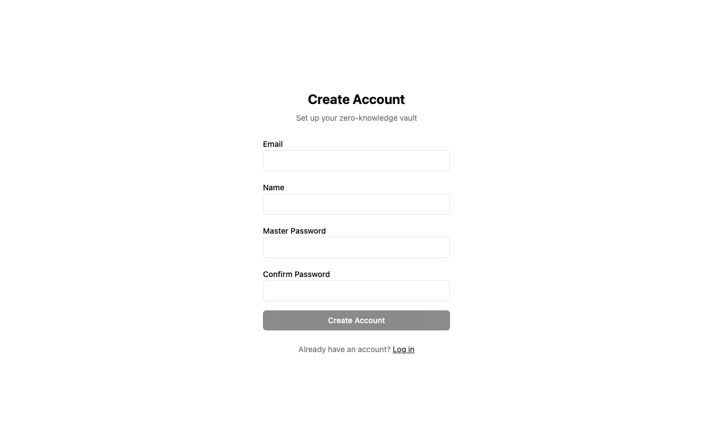
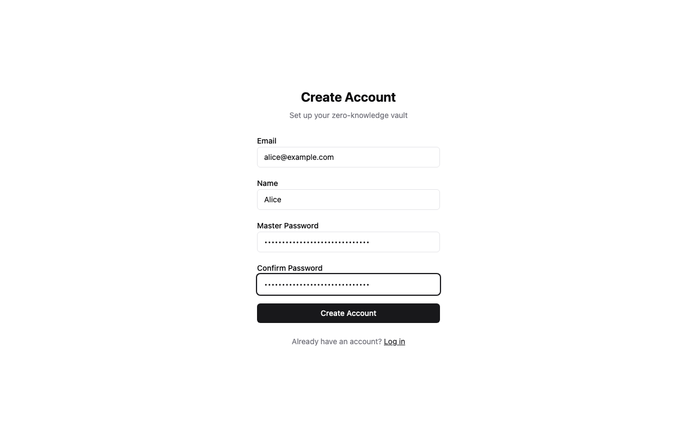
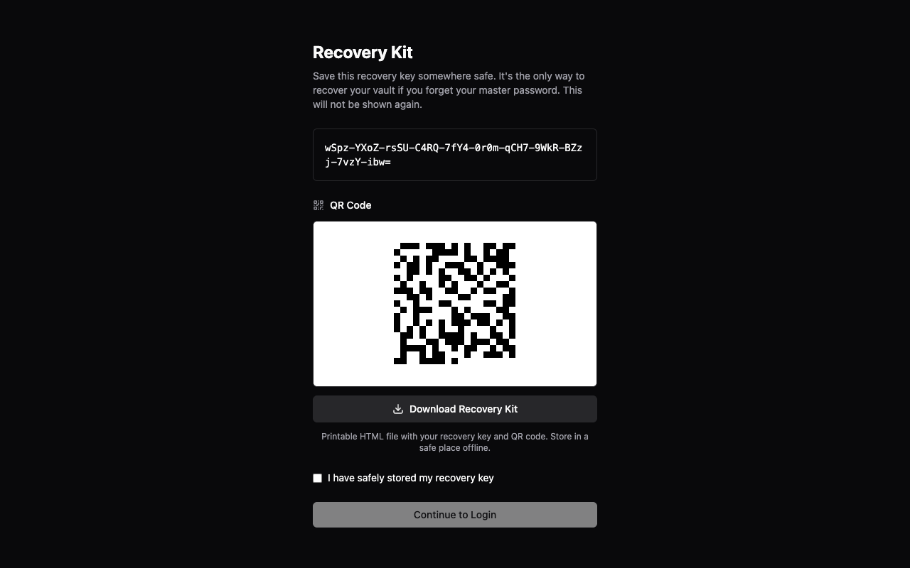
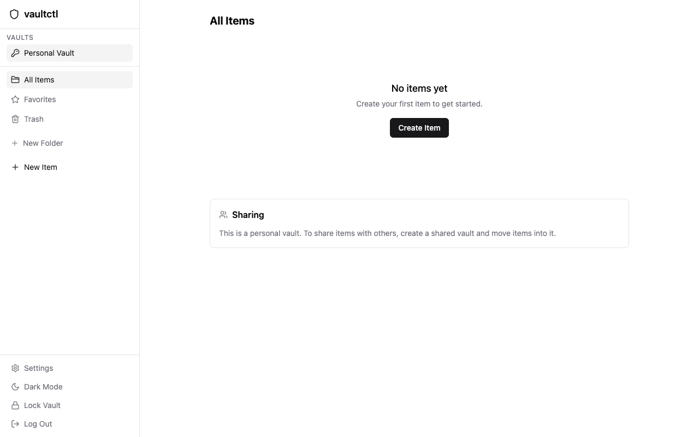
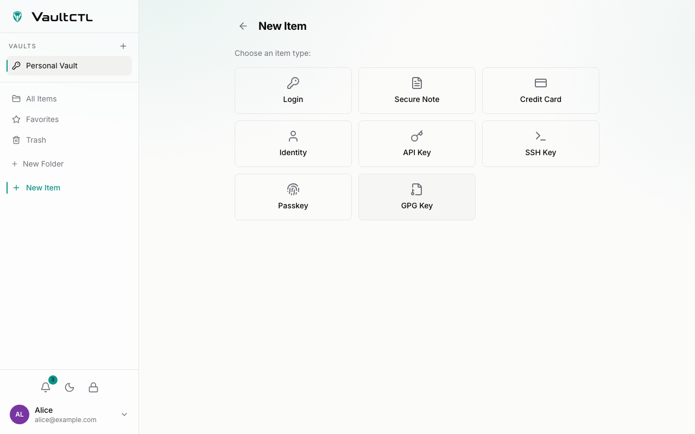
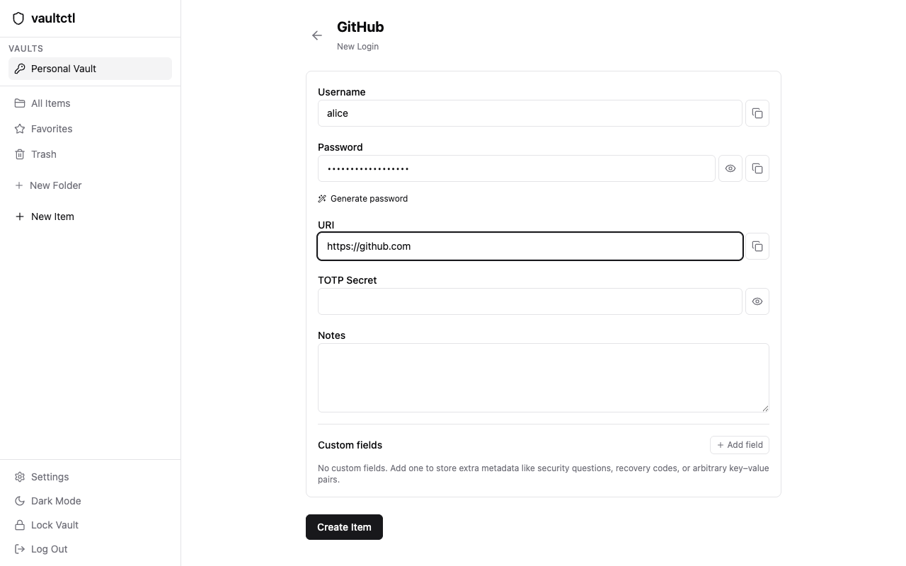
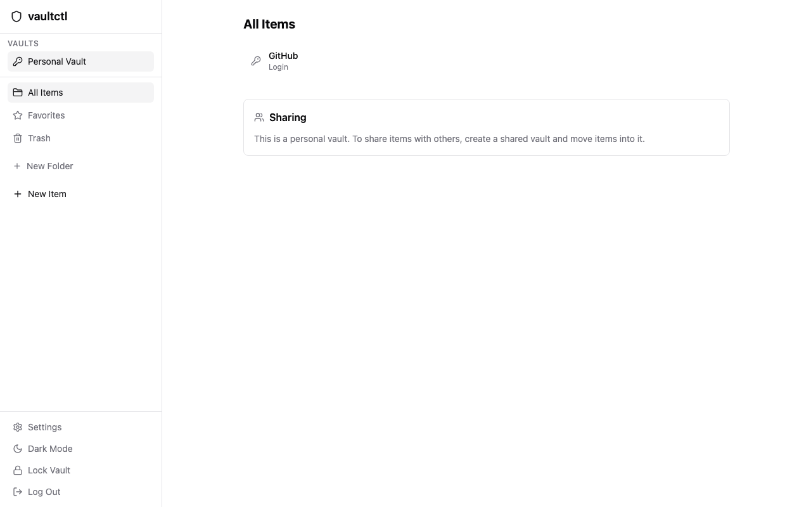

# Setup walkthrough

End-to-end first-deploy walkthrough on a fresh host. Captured against the bundled `docker-compose.simple.yml` stack with the SPA served by the embedded Go binary on `http://localhost:8090` (the production compose with Caddy uses `${VAULTCTL_BASE_URL}` and auto-TLS - the UI flow is the same).

## 1. Bring up the stack

Clone, fill in `.env`, then start:

```bash
git clone https://github.com/vineethkrishnan/vaultctl.git
cd vaultctl
cp .env.example .env
# fill every secret. generate values with:
#   openssl rand -base64 32   # 32-byte values
#   openssl rand -base64 64   # JWT secrets

docker compose up -d   # caddy + vaultctl + postgres; migrations run automatically on startup
```

Confirm the API is up:

```bash
curl -fsS https://${VAULTCTL_BASE_URL}/api/v1/health
# {"status":"ok"}
```

## 2. Open the SPA

The same Go binary serves the API and the embedded React SPA. Open `https://${VAULTCTL_BASE_URL}/` in a browser. You land on the login screen with a "Create one" link.



## 3. Register the first user

Click **Create one**. Fill in email, name, master password, and confirm.

The default `VAULTCTL_REGISTRATION_MODE` is `invite`, but on a fresh install the very first registration is always allowed and the resulting user is promoted to owner. The configured mode applies from the second registration onward, so an invite-only server stays locked down after this step without any extra action.



The password is the only thing that ever derives your encryption keys - there is no way to recover items without it (or the recovery kit shown next). Pick something strong; the embedded denylist will reject the obvious offenders.



Submit. The browser does the heavy crypto in a worker - Argon2id key derivation, RSA-2048 keypair, Ed25519 identity keypair, AES-KW vault key wrap - before anything hits the server. You then land on the recovery kit screen.

## 4. Save the recovery kit

The 24-word recovery key (rendered both as text and as a QR code) is shown **once**. Click **Download Recovery Kit** to grab a printable HTML copy. Store the file somewhere offline; this is the only path back to your vault if you forget the master password.



Tick the confirmation, click **Continue to Login**, and re-enter your email and master password. You land on your empty Personal Vault.



## 5. Add the first item

Click **New Item**. Choose a type - Login, Secure Note, Credit Card, Identity, API Key, SSH Key, or Passkey.



Fill in the fields. Use the built-in **Generate password** button if you'd rather a strong random password than typing one in.



Save. Every encrypted blob round-trips through the worker - the server only ever sees ciphertext. The item shows up in the vault list:



## 6. Install the browser extension

The MV3 extension (Chrome and Firefox) talks to the same server and does all crypto client-side, exactly like the SPA.

Build it from the repo:

```bash
cd extension
npm ci
npm run build            # Chrome -> .output/chrome-mv3
npm run build:firefox    # Firefox -> .output/firefox-mv3
```

Load the unpacked build:

- **Chrome / Edge / Brave:** open `chrome://extensions`, enable **Developer mode**, click **Load unpacked**, and pick `extension/.output/chrome-mv3`.
- **Firefox:** open `about:debugging#/runtime/this-firefox`, click **Load Temporary Add-on**, and pick `extension/.output/firefox-mv3/manifest.json`.

Open the toolbar popup, point it at the same server URL you deployed, then sign in with your email and master password to unlock. The vault key is derived in the popup and held only in the background service worker for the session.

Once unlocked the extension:

- shows a vaultctl emblem inside matching login fields; click it (or focus the field) to pick a credential to fill,
- offers a non-blocking **Save / Update** toast after you submit a login, and captures credit cards and identities from checkout forms,
- fills live TOTP codes for logins that carry a 2FA secret,
- suggests a strong password on signup / new-password fields.

**Autofill on page load is off by default.** The extension only fills automatically when you turn on **Autofill on page load** in the popup's **Settings -> Autofill & saving**; until then, use the field emblem or the `Ctrl/Cmd+Shift+L` shortcut to fill on demand. Auto-fill only triggers when exactly one stored login matches the page, so you are never silently filled with the wrong credential.

## 7. From here

- **CLI:** `vaultctl login`, `vaultctl ls`, `vaultctl get GitHub` - uses the same backend, decrypts client-side. See [`README.md`](../../README.md#cli).
- **Set up 2FA:** add a TOTP authenticator in **Settings** -> security. The app can also store and show live TOTP codes for your other accounts.
- **Verify your email:** if the server has SMTP configured, confirm the code sent on signup before the read-only grace expires. See [`email.md`](email.md).
- **Enable digests:** opt into a periodic activity summary (and tune its schedule and timezone) in **Settings**, once mail is configured.
- **Connect a backup destination:** add local, S3, WebDAV, or a cloud provider in **Settings** -> backup sync for scheduled encrypted backups. See [`backup-sync.md`](backup-sync.md).
- **Sharing:** create a shared vault, then invite a teammate from **Admin** -> **Invites**.
- **Backups (admin DB dump):** `vaultctl backup --output /var/backups/vaultctl` runs an encrypted dump and prunes per `VAULTCTL_BACKUP_RETENTION_DAYS`.
- **Configuration:** every server setting and its default is in [`configuration.md`](configuration.md).
- **Verify the release** you actually installed: see [`docs/security/verifying-releases.md`](../security/verifying-releases.md).

## Notes on this walkthrough

- The screenshots were captured against branch `chore/production-deploy-readiness` running locally on `127.0.0.1:8090` (avoiding port 8080 which was held by an unrelated process). Production stacks normally bind 8080 behind Caddy on 443.
- The demo email `alice@example.com` and demo password `Sandbox-Walkthrough-Demo-2026!` are walkthrough-only. Use real credentials in your own deploy.
- The recovery key visible in the screenshot is from the throwaway sandbox. Each user gets their own.
